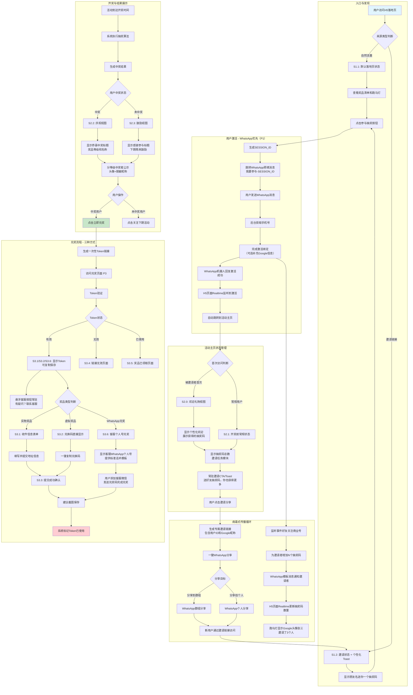
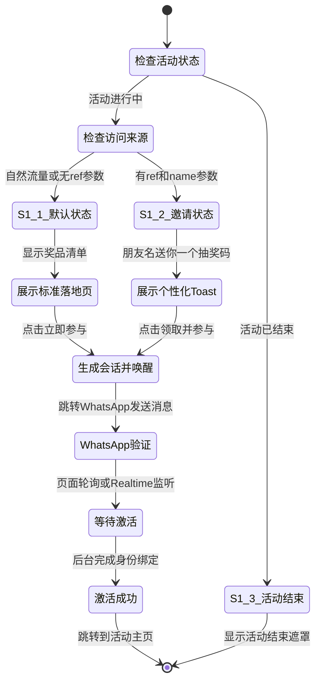
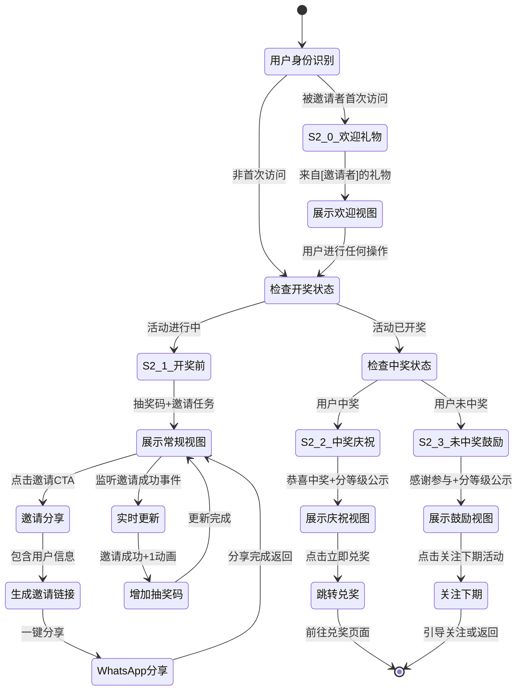
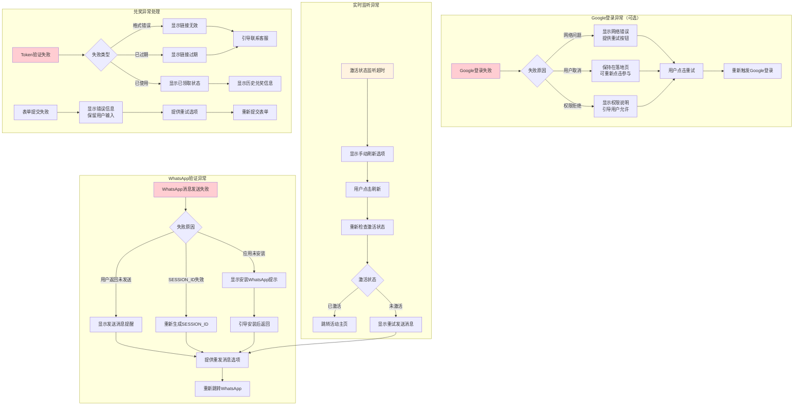
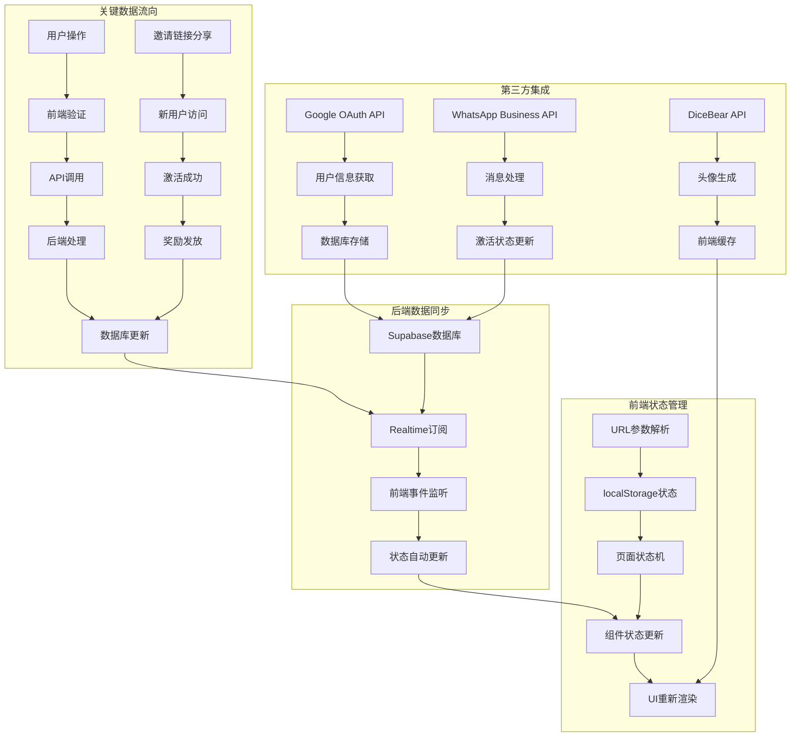

# 用户流程设计 (User Flow Design)

## 📋 **文档信息**
**文档名称**: Flowchart.md  
**创建日期**: 2024年9月29日  
**版本**: v1.0  
**状态**: 进行中  
**基于**: core-requirements v1.0  

---

## 🎯 **流程设计概览**

基于已确认的12个用户故事和完整的Requirements规格，本文档定义了WhatsApp抽奖活动系统的完整用户流程设计。

### **核心设计原则**
- **激活路径**: WhatsApp优先（直接唤醒）；Google登录为可选扩展（用于头像/数据完善）
- **利他分享心理学**: 强调帮助朋友而非自己获利
- **透明度优先**: 中奖信息完全公开透明
- **客服支持常驻**: 关键环节都有客服联系方式
- **三种兑奖方式**: 适应不同奖品类型的灵活兑奖

---

## 🗺️ **主流程图: 完整用户生命周期**



---

## 📱 **页面状态机设计**

### **P1: 落地页状态机**



### **P2: 活动主页状态机**



### **P3: 兑奖页状态机**

```mermaid
stateDiagram-v2
    [*] --> Token验证
    Token验证 --> S3_4_无效链接: Token无效或过期
    Token验证 --> S3_5_已领取: Token已被使用
    Token验证 --> 奖品类型判断: Token有效
    
    奖品类型判断 --> S3_1_实物奖品: 实物类型
    奖品类型判断 --> S3_2_虚拟奖品: 虚拟类型
    奖品类型判断 --> S3_6_WhatsApp兑奖: WhatsApp个人号类型
    
    S3_1_实物奖品 --> 展示地址表单: 显示Token+客服按钮
    S3_2_虚拟奖品 --> 展示兑换码: 显示Token+客服按钮
    S3_6_WhatsApp兑奖 --> 展示客服信息: 显示Token+个人号+话术
    
    展示地址表单 --> 提交地址: 用户填写完成
    展示兑换码 --> 复制兑换码: 用户点击复制
    展示客服信息 --> 联系客服: 用户添加客服微信
    
    提交地址 --> S3_3_成功确认: 表单验证通过
    复制兑换码 --> S3_3_成功确认: 复制成功
    联系客服 --> S3_3_成功确认: 引导用户联系
    
    S3_3_成功确认 --> 建议截图: 显示成功信息
    建议截图 --> 标记已使用: 系统更新Token状态
    
    S3_4_无效链接 --> [*]: 显示错误信息
    S3_5_已领取 --> [*]: 显示已领取信息
    标记已使用 --> [*]: 兑奖流程完成
    
    note right of 展示地址表单 : 悬浮客服按钮<br/>有疑问？联系客服
    note right of 展示兑换码 : Token可复制保存<br/>客服支持常驻
    note right of 展示客服信息 : 话术模板：<br/>我是活动中奖用户<br/>兑奖码: TOKEN
```

---

## ⚠️ **异常处理与边界情况**

### **关键异常流程**



### **边界情况处理**

#### **用户行为边界**
- **快速连续点击**: 防抖处理，避免重复请求
- **页面刷新**: 保持状态，基于localStorage和数据库状态恢复
- **浏览器返回**: 正确处理页面状态，避免流程断裂
- **长时间停留**: Session保活机制，避免登录状态丢失

#### **技术边界**
- **网络断开**: 显示离线提示，恢复后自动重试
- **API响应超时**: 显示加载提示，提供重试选项
- **Realtime连接断开**: 自动重连机制，备用轮询方案
- **Google OAuth限流**: 错误提示和延迟重试

#### **业务边界**
- **活动未开始**: 显示倒计时，禁用参与按钮
- **活动已结束**: 全局遮罩，仍可查看结果
- **奖品数量不足**: 实时检查，动态调整显示
- **重复参与**: 基于Google ID和手机号去重

---

## 🔄 **状态同步与数据流**

### **关键状态管理**



### **关键数据结构**

```javascript
// 用户状态数据结构
const UserState = {
  // Google登录信息
  google: {
    id: "google_123456",
    name: "张三",
    email: "zhangsan@gmail.com",
    picture: "https://lh3.googleusercontent.com/..."
  },
  
  // WhatsApp验证信息
  whatsapp: {
    phone: "+1234567890",
    verified: true,
    session_id: "SESSION_ABC123"
  },
  
  // 活动参与状态
  activity: {
    activated: true,
    lottery_codes: 3,
    invited_by: "user_456",
    invited_count: 2,
    lottery_result: "pending" | "won" | "lost",
    won_prize: null
  },
  
  // 页面状态
  page: {
    current: "home",
    state: "S2.1",
    first_visit: false
  }
}

// 活动配置数据结构
const ActivityConfig = {
  // 基础信息
  id: "activity_001",
  name: "iPhone15抽奖活动",
  start_time: "2024-10-01T00:00:00Z",
  end_time: "2024-10-31T23:59:59Z",
  
  // 奖品配置
  prizes: [
    {
      tier: "一等奖",
      name: "iPhone 15 Pro 256GB",
      quantity: 1,
      image_url: "...",
      redemption_type: "form" | "virtual" | "whatsapp"
    }
  ],
  
  // 营销参数
  marketing: {
    invite_reward_codes: 1,
    initial_participants_base: 1000,
    banner_image_url: "...",
    marquee_messages: [
      "[头像] xxx参与了抽奖",
      "[头像] xx邀请了x个人"
    ]
  },
  
  // WhatsApp集成
  whatsapp: {
    business_number: "+1234567890",
    customer_service_number: "+0987654321",
    template_messages: {
      activation_success: "激活成功！您已获得1个抽奖码",
      invite_success: "恭喜！您的好友已加入，您获得1个新抽奖码"
    }
  }
}
```

---

## 📊 **流程性能与监控**

### **关键性能指标**

| 流程节点 | 性能目标 | 监控方式 |
|----------|----------|----------|
| 落地页加载 | <2s | Google Analytics pageload |
| Google登录响应 | <2s | OAuth API响应时间 |
| WhatsApp跳转 | <1s | 前端性能监控 |
| 激活状态检查 | <3s | Realtime延迟监控 |
| 页面状态切换 | <500ms | 前端性能API |
| 头像加载 | <1s | 图片加载完成事件 |
| 兑奖页面响应 | <2s | 端到端监控 |

### **关键转化率监控**

| 转化节点 | 目标转化率 | GA4事件埋点 |
|----------|------------|-------------|
| 访问→点击参与 | >70% | participate_click |
| 点击→Google登录完成 | >85% | google_login_success |
| Google登录→WhatsApp验证 | >80% | whatsapp_verification |
| 激活→首次邀请分享 | >30% | first_invite_share |
| 中奖→开始兑奖 | >95% | redemption_start |
| 开始兑奖→完成兑奖 | >90% | redemption_complete |

---

## ✅ **验收标准总结**

### **流程完整性验收**
- [ ] 三个主要流程图覆盖所有用户故事场景
- [ ] 页面状态机包含所有定义的状态转换
- [ ] 异常处理覆盖所有关键失败点
- [ ] 边界情况处理完整无遗漏

### **用户体验验收**
- [ ] 用户操作路径清晰直观，无困惑点
- [ ] 异常情况都有友好的错误提示和恢复路径
- [ ] 关键节点都有适当的反馈和确认
- [ ] 流程符合移动端操作习惯

### **技术实现验收**
- [ ] 所有状态转换都有明确的触发条件
- [ ] 数据同步机制支持实时更新
- [ ] 异常恢复机制健壮可靠
- [ ] 性能指标符合设计要求

### **业务价值验收**
- [ ] 流程设计最大化病毒传播效果
- [ ] 双重验证确保数据完整性
- [ ] 透明度设计增强用户信任
- [ ] 客服支持降低用户流失

---

**文档状态**: 待用户确认审批  
**下一步**: 等待用户确认后进入任务1.3功能模块划分  
**负责人**: UI/UX设计专家  
**创建时间**: 2024年9月29日

---

**重要**: 此流程设计文档基于已确认的用户故事和Requirements规格，所有流程都必须严格按照设计实现，确保用户体验的一致性和完整性。
