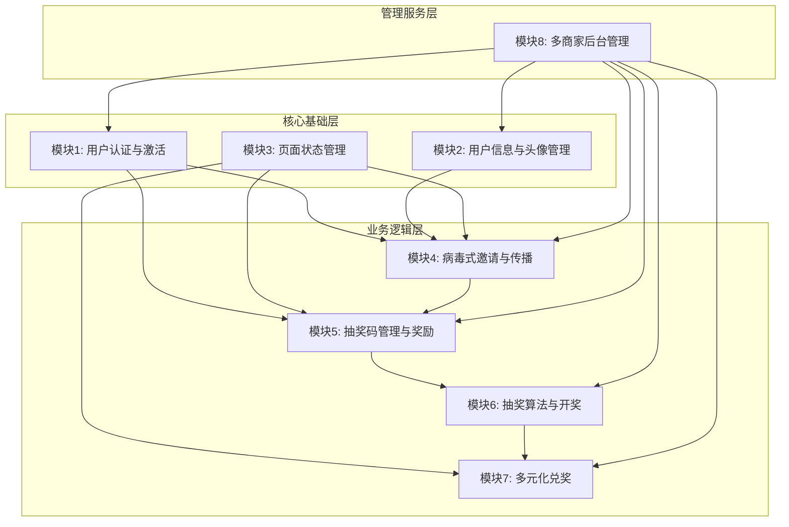

# 功能模块划分与架构设计

## 📋 **文档信息**
**文档名称**: Module_Architecture.md  
**创建日期**: 2024年9月29日  
**版本**: v1.0  
**基于**: core-requirements v1.0 和用户流程设计  

---

## 🎯 **核心功能模块识别**

基于已完成的需求规格和用户流程分析，系统划分为以下8个核心功能模块：

### **模块1: 用户认证与激活模块 (User Authentication & Activation)**
**核心职责**: 处理WhatsApp验证与会话激活
**主要功能**:
- SESSION_ID生成和管理  
- WhatsApp预填消息跳转
- 用户身份绑定（WhatsApp手机号）
- 激活状态实时监听

**关键技术组件**:
- SessionManager  
- WhatsAppIntegration
- UserActivationHandler

---

### **模块2: 用户信息与头像管理模块 (User Profile & Avatar Management)**
**核心职责**: 管理用户信息和头像显示策略
**主要功能**:
- DiceBear头像生成API集成（降级方案）
- 虚拟用户头像库管理
- 头像显示优先级策略（DiceBear > 虚拟头像 > 默认头像）
- 跑马灯头像统一风格管理（32px圆形）

**关键技术组件**:
- UserProfileService
- AvatarManager
- DiceBearIntegration
- VirtualAvatarLibrary

---

### **模块3: 页面状态管理模块 (Page State Management)**
**核心职责**: 管理三个页面的复杂状态转换
**主要功能**:
- 基于状态机的页面状态控制
- P1落地页状态（S1.1/S1.2/S1.3）
- P2活动主页状态（S2.0/S2.1/S2.2/S2.3）
- P3兑奖页状态（S3.1/S3.2/S3.3/S3.4/S3.5/S3.6）
- 状态持久化（localStorage）
- URL参数解析和状态恢复

**关键技术组件**:
- PageStateMachine
- StateManager
- URLParameterHandler
- LocalStorageManager

---

### **模块4: 病毒式邀请与传播模块 (Viral Invitation & Propagation)**
**核心职责**: 处理邀请链接生成和病毒传播机制
**主要功能**:
- 专属邀请链接生成（包含ref_id和昵称）
- 一键WhatsApp分享功能（群组/个人联系人）
- 邀请关系追踪和管理
- 利他分享心理学应用（常驻CTA/Toast设计）
- 邀请成功实时奖励发放
- 跑马灯实时展示邀请动态

**关键技术组件**:
- InvitationLinkGenerator
- WhatsAppShareHandler
- InvitationTracker
- ViralRewardSystem

---

### **模块5: 抽奖码管理与奖励模块 (Lottery Code & Reward Management)**
**核心职责**: 管理用户抽奖码和奖励发放
**主要功能**:
- 抽奖码生成和分配
- 邀请奖励计算（每邀请1人获得1个抽奖码）
- 实时抽奖码数量更新
- Supabase Realtime实时同步
- 抽奖码列表展示和管理
- 奖励动画和Toast通知

**关键技术组件**:
- LotteryCodeManager
- RewardCalculator
- RealtimeUpdater
- AnimationController

---

### **模块6: 抽奖算法与开奖模块 (Lottery Algorithm & Draw)**
**核心职责**: 执行公平抽奖和结果管理
**主要功能**:
- 公平抽奖算法实现
- 中奖结果计算和存储
- 分等级中奖者公示数据生成
- 中奖/未中奖状态页面数据准备
- 抽奖结果透明化展示

**关键技术组件**:
- LotteryAlgorithm
- DrawResultManager
- WinnerPublicDisplay
- TransparencyHandler

---

### **模块7: 多元化兑奖模块 (Multi-Modal Redemption)**
**核心职责**: 处理三种不同的兑奖方式
**主要功能**:
- 安全兑奖Token生成和验证
- **方式1**: 实物奖品收件信息表单系统
- **方式2**: 虚拟奖品兑换码直接显示
- **方式3**: WhatsApp个人号兑奖引导流程
- Token透明展示和复制功能
- 客服支持常驻（悬浮客服按钮）
- 防重复领取和链接滥用

**关键技术组件**:
- RedemptionTokenManager
- DynamicFormSystem
- VirtualCodeDisplay
- WhatsAppRedemptionGuide
- CustomerSupportWidget

---

### **模块8: 多商家后台管理模块 (Multi-Tenant Admin Management)**
**核心职责**: SaaS级后台管理和多租户支持
**主要功能**:
- **多租户数据隔离**和权限管理系统
- 活动配置界面（奖品、时间、规则等）
- **视觉内容管理**（Banner图、奖品图片上传）
- **跑马灯消息配置**和虚拟头像库管理
- **WhatsApp集成配置**（多商家支持不同商业号）
- **Google Analytics 4集成**配置
- 中奖者信息管理和导出
- 数据统计和分析面板

**关键技术组件**:
- MultiTenantManager
- ActivityConfigurationUI
- MediaUploadManager
- MarqueeMessageConfigurator
- WhatsAppIntegrationConfig
- GA4AnalyticsManager
- WinnerManagementSystem

---

## 🔗 **模块依赖关系分析**

### **依赖层次结构**

### **关键依赖关系**

#### **强依赖关系** (必须按顺序开发)
1. **模块1 → 模块4**: 邀请功能需要用户已认证激活
2. **模块1 → 模块5**: 抽奖码分配需要用户身份确认
3. **模块4 → 模块5**: 邀请成功后需要奖励发放
4. **模块5 → 模块6**: 抽奖需要抽奖码数据
5. **模块6 → 模块7**: 兑奖需要中奖结果

#### **接口依赖关系** (需要协调开发)
1. **模块2 ↔ 模块4**: 头像管理 ↔ 跑马灯显示
2. **模块3 ↔ 所有业务模块**: 状态管理作为协调中心
3. **模块8 → 所有模块**: 后台配置影响前端所有功能

#### **可并行开发** (相对独立)
1. **模块1** 和 **模块2** 可以并行开发
2. **模块3** 可以先建立框架，后续集成其他模块
3. **模块8** 的UI部分可以独立开发

---

## ⚠️ **技术难点和风险识别**

### **高风险技术难点** 🔴

#### **难点1: WhatsApp验证流程可靠性**
**风险等级**: 高  
**技术挑战**:
- WhatsApp URL Scheme的跨平台一致性
- 验证流程的异常情况处理
- 用户流程中断后的状态恢复

**风险缓解**:
- 充分的移动端浏览器兼容性测试
- 备用方案：提供重试与兜底文案
- 完善的错误处理和重试机制

#### **难点2: 多商家SaaS架构的数据隔离**
**风险等级**: 高  
**技术挑战**:
- Supabase的Row Level Security (RLS) 复杂配置
- 多租户权限管理的安全性保证
- 数据泄露防护和访问控制
- 不同商家配置的动态切换

**风险缓解**:
- 详细的RLS策略设计和测试
- 分阶段实现：先单商家，后多商家
- 安全审查和渗透测试

#### **难点3: 实时功能的稳定性和性能**
**风险等级**: 高  
**技术挑战**:
- Supabase Realtime的连接稳定性
- 大量并发用户的实时更新性能
- 网络中断后的重连和状态同步
- 实时数据的一致性保障

**风险缓解**:
- 实时功能降级方案（轮询备选）
- 连接池和重连机制
- 充分的压力测试和性能优化

### **中风险技术难点** 🟡

#### **难点4: 三种兑奖方式的统一管理**
**风险等级**: 中  
**技术挑战**:
- 动态表单系统的复杂性
- Token安全性和防滥用机制
- WhatsApp个人号兑奖的用户引导
- 不同兑奖方式的状态管理

**风险缓解**:
- 模块化设计，每种方式独立实现
- Token加密和时效性控制
- 详细的用户引导和客服支持

#### **难点5: 头像管理的多级降级策略**
**风险等级**: 中  
**技术挑战**:
- DiceBear API的稳定性依赖
- 头像加载失败的降级处理
- 虚拟头像库的管理复杂性
- 跑马灯头像的流畅显示

- 多级降级：DiceBear → 虚拟 → 默认
- 头像预加载和缓存策略
- 虚拟头像的批量管理工具

### **低风险技术难点** 🟢

#### **难点6: Google Analytics 4集成**
**风险等级**: 低  
**技术挑战**:
- GA4事件埋点的完整性
- 自定义维度配置的准确性
- 跨页面事件追踪的连续性

**风险缓解**:
- 使用成熟的GA4集成库
- 完整的事件映射表和测试

#### **难点7: 移动端响应式优化**
**风险等级**: 低  
**技术挑战**:
- 复杂状态下的布局适配
- 触摸交互的用户体验优化
- 不同设备尺寸的兼容性

**风险缓解**:
- Mobile-first设计原则
- 充分的设备测试和用户反馈

---

## 🎯 **开发优先级建议**

### **Phase 1: 核心基础 (Week 8-9)**
**优先级**: P0 (必须完成)
- **模块1**: 用户认证与激活模块
- **模块2**: 用户信息与头像管理模块  
- **模块3**: 页面状态管理模块

**理由**: 这些是整个系统的基础，所有其他功能都依赖于此

### **Phase 2: 病毒传播核心 (Week 10)**
**优先级**: P0 (必须完成)
- **模块4**: 病毒式邀请与传播模块
- **模块5**: 抽奖码管理与奖励模块

**理由**: 病毒传播是产品的核心价值，必须优先保证

### **Phase 3: 抽奖与兑奖 (Week 11)**
**优先级**: P1 (重要完成)
- **模块6**: 抽奖算法与开奖模块
- **模块7**: 多元化兑奖模块

**理由**: 完成用户完整体验闭环

### **Phase 4: 管理后台 (Week 12)**
**优先级**: P1 (重要完成)
- **模块8**: 多商家后台管理模块

**理由**: 商家自主管理能力，提升产品商业价值

---

## 📊 **资源分配建议**

### **开发人力分配**
- **前端开发**: 2人（页面状态管理 + 用户交互）
- **后端开发**: 1人（API和数据库）
- **集成开发**: 1人（第三方API集成）
- **UI/UX**: 1人（持续设计支持）

### **关键里程碑**
- Week 8结束: 用户认证和基础状态管理完成
- Week 9结束: 头像管理和页面状态完整
- Week 10结束: 病毒传播功能可用
- Week 11结束: 完整用户流程可测试
- Week 12结束: 后台管理系统就绪

---

## ✅ **验收标准**

### **模块完成标准**
- [ ] 所有核心功能正常工作
- [ ] 异常情况处理完善
- [ ] 单元测试覆盖率>85%
- [ ] 与其他模块集成无问题
- [ ] 性能符合设计目标

### **整体集成标准** 
- [ ] 端到端用户流程畅通
- [ ] 实时功能稳定可靠
- [ ] 多商家数据完全隔离
- [ ] 移动端体验完美
- [ ] 安全措施有效防护

---

**文档版本**: v1.0  
**创建日期**: 2024年9月29日  
**基于需求**: core-requirements v1.0  
**下一步**: 基于此模块划分更新PROJECT_TASK_PLAN.md  

---

**重要**: 此模块划分基于完整的需求规格制定，后续的技术架构设计和开发任务分解都应严格遵循此架构。
