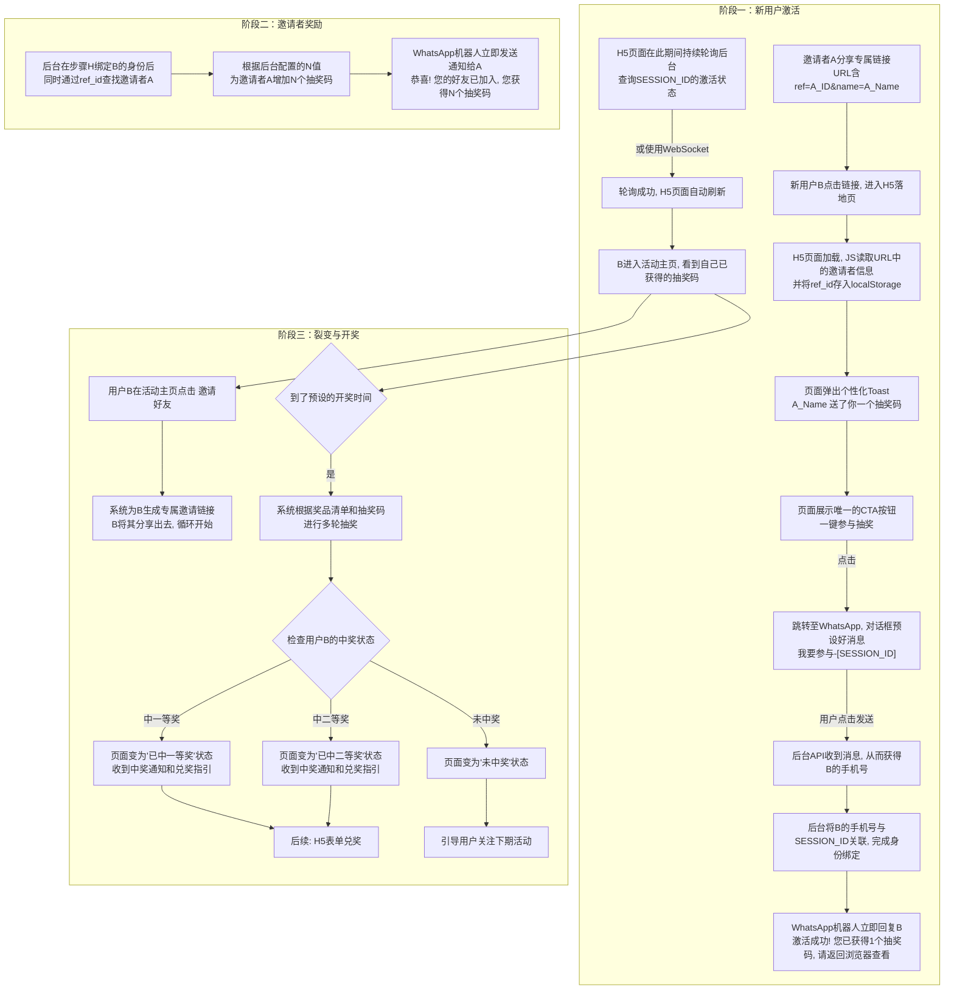

### **.WhatsApp抽奖活动PRD_v1.0**

---

#### **1. 背景与产品定位**
* **应用名称**: WhatsApp抽奖活动
* **产品定位**: 一款基于H5的、通过WhatsApp进行病毒式传播和粉丝沉淀的营销活动工具。
* **目标用户**: 希望通过低成本社交裂变方式，为其WhatsApp私域流量池获取新用户的各类商家或品牌。
* **核心目标**: 
    1.  **用户增长**: 实现病毒式传播，最大化活动参与人数。
    2.  **粉丝沉淀**: 将所有活动参与者转化为WhatsApp商业号的可触达粉丝，构建私域流量池。
* **产品形态**: H5 移动端网页
* **多语言需求**: 否 (初期版本仅支持单一语言)，默认使用西语

#### **2. 技术要求**
* **前端**: Vite + 原生TypeScript (Vanilla TS)。此方案轻量、高效，足以满足H5活动页面的需求，避免了大型框架的复杂性。
* **后端 & 数据库**: Supabase。采用其作为核心的BaaS（后端即服务），理由如下：
    1.  **内置PostgreSQL**: 提供稳定、强大的数据库支持。
    2.  **自动生成API**: 极大简化后端的开发工作量。
    3.  **实时(Realtime)功能**: 可直接用于实现H5页面的自动刷新。前端可监听数据库中用户状态的变更，一旦激活成功，页面即可收到通知并刷新，无需自行搭建WebSocket服务。
    4.  **边缘函数(Edge Functions)**: 用于承载接收WhatsApp消息、处理邀请逻辑等核心后端业务代码。
* **核心依赖**: 
    *   **WhatsApp Business API**: 业务流程强依赖此API，项目启动前需完成所有申请、配置及消息模板审核。

#### **3. 用户路径 (User Flow)**

#### 4. 页面结构总览 (Page Structure Overview)

本章节将以“状态机”的视角，详细定义“什么用户”在“什么时间/状态”下，会看到“什么界面”，并穷举关键的边缘情况。

### Part 1: 核心页面定义

我们将所有用户可能看到的界面归纳为 **2个核心页面** 和 **1个独立页面**。

*   **P1: 落地页 (`/`)**
    *   **核心职责**: 作为“流量入口”，负责吸引**新用户**或**未参与活动的老用户**，并引导他们完成“登录/激活”操作。
    *   **页面结构 (对齐 `demo-a.html`)**:
        1.  `Header`: 顶栏，包含**工具名称**及操作入口。
        2.  `Hero Banner`: 包含活动主视觉的卡片。
        3.  `Prize List`: **奖品清单**，用于展示一、二、三等奖等所有奖品信息。
        4.  `Countdown`: 倒计时卡片。
        5.  `Sponsor Area`: 赞助商信息卡片。
        6.  `Activity Rules`: 活动说明。
        7.  `Main CTA`: 主要交互按钮区。
        8.  `Footer`: 页脚。

*   **P2: 活动主页 (`/home`)**
    *   **核心职责**: 作为**已参与用户**的“个人中心”，集中展示其所有活动相关状态。
    *   **页面结构**:
        1.  `Header`: 显示用户身份（优先Google昵称，否则为脱敏手机号）。
        2.  `My Codes`: 展示用户当前持有的所有抽奖码。
        3.  `Invite Task`: “邀请好友，赢取更多抽奖码”的功能区域。
        4.  `Activity Status`: 开奖结果展示区（开奖后显示）。

*   **P3: 兑奖页 (`/claim`)**
    *   **核心职责**: 一个独立的表单页，仅供中奖用户填写领奖信息。

### Part 2: 用户状态与视图的详细映射

#### **A. 新用户 (从未访问过)**

1.  **状态**: 首次通过链接（无论是自然流量还是邀请链接）进入。
2.  **看到什么**: **P1: 落地页**。
    *   如果来自邀请，页面会额外弹出个性化Toast：“[好友名]送你一个抽奖码”。
    *   用户点击唯一的CTA按钮后，将跳转至WhatsApp发送一条预设消息，后台通过此消息自动完成激活和身份绑定（**“点击即激活”流程**），无需用户手动输入或验证口令码。
    *   激活成功后，页面将自动刷新或跳转至 **P2: 活动主页**。

#### **B. 老用户 (已在系统中创建过账户)**

1.  **状态**: 访问活动链接时，系统通过浏览器Cookie或Session识别出其身份。
2.  **看到什么**:
    *   **情况一：如果该老用户还`未参与`本次抽奖**
        *   他看到的依然是 **P1: 落地页**。
        *   但由于他已登录，点击“参与抽奖”后，**无需再次谷歌登录**，直接进入“WhatsApp口令码验证”环节。
    *   **情况二：如果该老用户已经`参与`了本次抽奖**
        *   系统应**直接将他跳转到 P2: 活动主页**，让他立刻看到自己的抽奖码和邀请状态，而不是让他再看一遍落地页。

#### **C. 所有已参与用户 (在活动主页中的状态)**

1.  **状态**: 访问 **P2: 活动主页**。
2.  **看到什么**:
    *   **开奖前**: 页面显示“我的抽奖码”和“邀请好友”模块。当其邀请的好友成功激活后，此页面会收到实时事件，并**自动**增加抽奖码数量，同时弹出“+1”等动画提示，无需用户刷新。
    *   **开奖后 (中奖)**: 页面变为“**庆祝视图**”。“邀请好友”功能消失，主区域变为一个醒目的中奖信息卡片，内容包括“恭喜您！您赢得了 [奖品名称]！”。“我的抽奖码”列表中，中奖的那个码可以高亮显示。卡片上有一个唯一的CTA按钮“**立即兑奖**”，点击后跳转至 **P3: 兑奖页**。
    *   **开奖后 (未中奖)**: 页面变为“**鼓励视图**”。“邀请好友”功能消失。主区域变为一个“很遗憾，本次未中奖”的提示卡片。此卡片应包含**本期中奖号码公示**，并提供一个“关注下期活动”的CTA按钮。

#### **D. 所有用户 (边缘情况)**

1.  **状态**: 在活动设定时间结束后访问任何页面。
2.  **看到什么**: 任何页面都应显示一个统一的“**活动已结束**”的视图或遮罩层。此视图应包含中奖结果公示，并引导用户关注下期活动。
3.  **状态**: 未中奖用户通过URL直接访问 **P3: 兑奖页**。
4.  **看到什么**: 页面应显示“无效链接”或“您没有权限访问此页面”，并引导其返回 **P2: 活动主页**。

#### 5. 前端页面详情 (Frontend Page Details)  

##### 5.1 落地页 (P1)

*   **核心功能-必须有**:
    1.  **清晰展示多级奖励**: 通过奖品清单，明确告知用户所有奖品等级和内容，用丰富的奖励吸引用户参与。
    2.  通过**跑马灯、参与人数**等社交证明元素，营造活动火热氛围，提升用户信任感。
    3.  提供唯一的、明确的行动召唤（CTA），引导用户完成WhatsApp激活。
    4.  根据用户来源（自然流量 vs. 邀请），展示差异化信息。

*   **页面布局 (Layout - 对齐 `demo-a.html`)**:
    *   **Header**: 顶栏，包含**工具名称**“WhatsApp官方抽奖工具”及菜单/操作入口。
    *   **Hero Banner**: 包含核心奖品视觉图的卡片。
        *   **图片内部**: `跑马灯组件 (GC2)` 滚动活动动态。
    *   **Prize List**: **奖品清单模块**。以列表或卡片组的形式，清晰展示各等级奖品。每个奖品项应包含：
        *   `奖品等级` (如：一等奖)
        *   `奖品名称` (如：iPhone 15 Pro)
        *   `奖品图片`
        *   `奖品数量` (如：共1份)
    *   **Countdown**: 倒计时卡片。
    *   **Sponsor Area**: 赞助商信息卡片。
    *   **Activity Rules**: 活动说明卡片。
    *   **Main CTA Area**: 核心交互区，包含圆形“参与抽奖”按钮、参与人数等。
    *   **Footer**: 页脚，包含版权和链接。

*   **组件清单 (Component List)**:
    *   **奖品清单组件**: 用于渲染`Prize List`模块。
    *   **Toast通知组件 (GC1)**: 用于显示邀请信息。
    *   **跑马灯组件 (GC2)**: 用于在Hero Banner上滚动展示活动动态（可使用虚拟数据）。
    *   **倒计时组件**: 显示剩余的“天、时、分、秒”。
    *   **CTA按钮组件**: 核心交互按钮。

*   **页面状态 (Page States - 对应 `4. 页面结构总览` 中的定义)**:
    *   **`S1.1: 默认状态`**: 适用于自然流量或未参与的老用户。CTA按钮文字为“立即参与”。
    *   **`S1.2: 邀请状态`**: 适用于被邀请的新用户。页面加载时，触发`GC1` Toast提示。CTA按钮文字可优化为“领取并参与”。
    *   **`S1.3: 活动结束状态`**: 最高优先级状态。页面显示“活动已结束”的遮罩或卡片，CTA按钮禁用。

*   **交互说明 (Interaction Details)**:
    *   **加载时 (On Load)**:
        1.  前端JS首先检查活动全局时间。若已结束，则强制渲染 `S1.3` 状态。
        2.  若活动进行中，JS检查URL中是否存在`ref`和`name`参数，若存在则触发`GC1` Toast并存下`ref`。
    *   **点击CTA按钮时**:
        1.  前端生成唯一的`SESSION_ID`。
        2.  浏览器跳转至 `https://wa.me/商业号?text=我要参与-[SESSION_ID]`。
        3.  页面开始通过Supabase Realtime订阅与`SESSION_ID`相关的状态变更。
        4.  一旦收到激活成功的消息，立即跳转至 `P2: 活动主页` (`/home`)。
    *   **点击赞助商链接时**:
        1.  在新标签页中打开赞助商的官方网站。

*   **可配置项 (Configurable Items)**:
    *   为了便于管理和复用，落地页中的以下元素必须从管理后台或配置文件中动态加载，禁止硬编码。
    *   **Prizes (奖品)**
        *   `activity.prizes`: 一个包含多个奖品对象的**数组 (JSON Array)**。后台应支持增删改查奖品项。每个奖品对象应包含以下字段：
            *   `tier` (string): 奖品等级，如 "一等奖"。
            *   `name` (string): 奖品名称，如 "iPhone 15 Pro 256GB"。
            *   `image_url` (string): 奖品图片地址。
            *   `quantity` (number): 该等级奖品的总数量。
    *   **Hero Banner**
        *   `activity.banner_image_url`: 奖品/活动的主视觉图片地址 (可选用一等奖图片作为主视觉)。
    *   **Countdown**
        *   `activity.end_time`: 控制倒计时结束的精确日期和时间 (ISO 8601格式)。
    *   **Sponsor Area**
        *   `sponsor.logo_url`: 赞助商的Logo图片地址。
        *   `sponsor.name`: 显示在Logo旁的赞助商官方名称。
        *   `sponsor.website_url`: 点击“查看”按钮后跳转的链接。
    *   **Activity Rules**
        *   `activity.rules_text`: 活动说明区域显示的规则文本，支持Markdown或富文本。
    *   **Main CTA Area**
        *   `cta.main_button_text`: 主CTA按钮上显示的文字，如“立即参与”。
        *   `cta.invite_button_text`: 用户被邀请时，主CTA按钮显示的文字，如“领取并参与”。
        *   `activity.initial_participants`: 用于展示的虚拟参与人数的基数。
    *   **Footer**
        *   `links.terms_of_service`: “服务条款”指向的URL。
        *   `links.privacy_policy`: “隐私政策”指向的URL。---
##### 5.2 活动主页 (P2)

*   **核心功能-必须有**:
    1.  **兑现初始奖励**: 对通过邀请链接进入的新用户，明确展示其获得的“欢迎礼物”（初始抽奖码），完成奖励闭环。
    2.  **激励二次分享**: 提供清晰、低门槛的邀请任务，驱动用户从“被邀请者”转变为“邀请者”。
    3.  **状态实时同步**: 清晰展示用户持有的抽奖码数量、开奖结果等，并通过实时反馈增强用户参与感。
    4.  **展示具体奖品**: 如果用户中奖，需要明确告知其中了**什么等级**的**什么奖品**。

*   **页面布局 (Layout)**:
    *   **Header**: 顶栏，左侧显示用户身份标识（优先Google昵称，否则为脱敏手机号），右侧可放置“活动规则”等次要入口。
    *   **我的抽奖码 (My Codes Card)**: 页面的核心信息模块。根据用户状态显示不同内容：
        *   **首次访问的被邀请者**: 显示为“欢迎礼物”卡片，包含个性化文案（如“来自[邀请者]的礼物！”），并告知其已获得的初始抽奖码数量。
        *   **普通状态**: 突出显示用户当前拥有的**抽奖码总数**，并提供“查看全部”按钮。
    *   **邀请任务 (Invite Task Card)**: 病毒裂变的核心功能模块。包含明确的行动指令和利益点（例如：“每成功邀请一位好友，即可额外获得 1 个抽奖码！”），并提供用户的**专属邀请链接**和“一键复制/邀请”按钮。
    *   **开奖状态 (Lottery Status Card)**: 根据活动所处阶段，显示倒计时或开奖结果。

*   **组件清单 (Component List)**:
    *   **用户身份组件**: 用于显示脱敏手机号或昵称。
    *   **分享/复制组件**: 提供一键复制链接或调用系统分享的功能。
    *   **Toast/通知组件 (GC1复用)**: 用于“复制成功”、“恭喜您！好友XX已加入...”等即时反馈。
    *   **抽奖码列表弹窗 (Modal)**: 点击“查看全部”时，弹窗显示用户所有的抽奖码列表。

*   **页面状态 (Page States)**:
    *   **`S2.0: 首次访问的被邀请者`**: 这是一个一次性的欢迎状态。当用户通过邀请链接首次激活并进入主页时触发。“我的抽奖码”卡片会渲染成一个特殊的“欢迎礼物”视图。用户进行任何操作（如点击邀请按钮）或下次访问时，此状态变为常规的`S2.1`状态。
    *   **`S2.1: 开奖前 (常规)`**: 用户的标准活动主页。完整显示“我的抽奖码”（常规版）和“邀请任务”两个模块。开奖状态卡显示倒计时。
    *   **`S2.2: 开奖后 - 中奖`**: “邀请任务”模块被一个醒目的“**恭喜中奖！**”的庆祝视图替代。该视图**必须清晰展示用户所中的奖品等级和名称**（例如：“恭喜！您获得了【二等奖：AirPods Pro】”），并提供唯一的“**立即兑奖**”CTA按钮。
    *   **`S2.3: 开奖后 - 未中奖`**: “邀请任务”模块被一个“**未中奖**”的鼓励视图替代。为确保公平透明，此视图应**公示本期所有等级的中奖号码**，并引导用户关注下期活动。

*   **交互说明 (Interaction Details)**:
    *   **加载时**: 页面加载，首先判断是否为首次访问的被邀请者（可通过localStorage中的`ref_id`和首次访问标记判断），若是，则渲染`S2.0`状态。否则，根据活动开奖状态和用户的中奖结果（中了哪个等级的奖，或未中奖）渲染`S2.1`、`S2.2`或`S2.3`。
    *   **实时监听**: 页面通过Supabase Realtime实时监听邀请成功事件。一旦监听到，前端**自动更新抽奖码总数**（可伴随+1动画），并触发`GC1` Toast通知：“恭喜您！好友[好友名]已加入，您获得N个新抽奖码”。
    *   **点击“一键复制/邀请”**: 触发分享/复制组件，将个人专属邀请链接复制到剪贴板，并弹出`GC1` Toast通知：“已复制，快去分享吧！”。

*   **可配置项 (Configurable Items)**:
    *   **欢迎礼物**
        *   `welcome.gift_title`: 欢迎礼物的标题，可包含`{inviter_name}`变量，如“来自 {inviter_name} 的礼物！”
        *   `welcome.gift_body`: 欢迎礼物的正文，可包含`{n}`变量，如“恭喜！您已获得 {n} 个初始抽奖码。”
    *   **邀请任务**
        *   `invite.task_title`: 邀请任务卡的标题，如“邀请好友，赢取更多！”
        *   `invite.task_reward_text`: 邀请奖励的描述文本，必须包含`{n}`作为变量，如“每成功邀请一位好友，即可额外获得 {n} 个抽奖码！”
        *   `invite.reward_codes_per_invite`: 每次成功邀请奖励的抽奖码数量 (即`{n}`的值)。
    *   **中奖/未中奖视图**
        *   `winner.title`: 中奖视图的标题。**此文本应支持变量**，如“恭喜！您获得了【{prize_tier}】！”
        *   `winner.body_text`: 中奖视图的正文。**此文本应支持变量**，如“您的奖品是：{prize_name}。请在24小时内兑奖。”
        *   `winner.cta_button_text`: 中奖视图的CTA按钮文案，如“立即兑奖”。
        *   `loser.title`: 未中奖视图的标题，如“很遗憾，本次未中奖”。
        *   `loser.body_text`: 未中奖视图的正文，如“感谢您的参与，请关注我们下次活动！”

##### 5.3 兑奖页 (P3)

*   **核心功能-必须有**:
    1.  **安全访问**: 必须通过一个与特定中奖记录关联的一次性令牌（Token）来验证访问权限，防止链接被盗用或滥用。
    2.  **差异化流程**: 根据奖品是“实物”还是“虚拟卡券”，提供完全不同的兑奖流程。
    3.  **信息收集 (实物奖)**: 安全、准确地收集用户邮寄地址等信息。
    4.  **奖品发放 (虚拟奖)**: 在页面上直接、清晰地展示兑换码等信息，并提供便捷的复制功能。
    5.  **明确状态反馈**: 在流程的每个节点，都给予用户清晰的状态告知，如“提交成功”、“链接已失效”等。

*   **页面布局 (Layout)**:
    *   **Header**: 统一的页面标题，如“奖品兑换中心”。
    *   **奖品信息卡片 (Prize Info Card)**: 页面最上方，始终展示用户当前正在兑换的奖品信息（图片、名称），让用户有确定感。
    *   **动态内容区 (Dynamic Content Area)**: 页面的核心，根据奖品类型和状态动态展示内容。
        *   **对于实物奖**: 显示一个用于填写收件信息的表单。
        *   **对于虚拟奖**: 直接显示奖品兑换码（或链接）和“一键复制”按钮。
        *   **对于错误/结束状态**: 显示相应的提示信息。

*   **组件清单 (Component List)**:
    *   **动态表单组件**: 可根据后台指令生成包含不同字段（如姓名、电话、省市区地址选择器、详细地址）的表单。
    *   **复制到剪贴板组件**: 用于一键复制虚拟兑换码。

*   **页面状态 (Page States)**:
    *   **`S3.1: 待领取 - 实物奖`**: 页面加载验证成功后，如奖品为实物，则显示收件信息表单。
    *   **`S3.2: 待领取 - 虚拟奖`**: 页面加载验证成功后，如奖品为虚拟卡券，则直接显示兑换码和复制按钮。
    *   **`S3.3: 提交/领取成功`**: 用户提交地址表单或点击复制兑换码后，页面进入此状态，显示“操作成功”的提示，并建议用户截图保存。
    *   **`S3.4: 链接无效或已过期`**: 当用户访问的兑奖链接中的Token无效、或已超过后台设定的兑奖有效期时，显示此状态。
    *   **`S3.5: 奖品已被领取`**: 当用户访问一个已经被使用过的兑奖链接时，显示此状态，防止重复领取。

*   **交互说明 (Interaction Details)**:
    *   **加载时 (On Load)**:
        1.  前端从URL中获取一次性兑奖`token`。
        2.  立即调用后端API `validate_claim_token`，并将`token`作为参数。
        3.  后端验证`token`的有效性、是否过期、是否已被使用，并返回奖品信息（类型、名称等）和当前状态。
        4.  前端根据API返回的状态码和数据，渲染对应的页面状态（S3.1 - S3.5）。**任何验证失败的情况，都不应展示奖品信息或表单。**
    *   **点击“提交地址”时 (实物奖)**:
        1.  前端校验表单字段的有效性。
        2.  调用后端API `submit_claim_info`，提交表单数据和`token`。
        3.  后端保存地址信息，并将该`token`永久标记为“已使用”。
        4.  API返回成功后，前端渲染 `S3.3` 成功状态。

*   **可配置项 (Configurable Items)**:
    *   **实物奖品表单**
        *   `claim.physical_form_fields`: 一个JSON配置，用于定义实物奖品表单需要收集哪些字段，以及各字段的校验规则。

#### 6. 管理后台设计 (Admin Panel Design)

*   **6.1 核心设计原则**
    *   **清晰直观**: 界面设计应极度清晰，避免引起误解的复杂操作，让非技术背景的运营人员也能轻松上手。
    *   **配置驱动**: 后台是所有前端内容的“单一事实来源”。前端的所有可变元素（文案、图片、规则、奖品）都必须能在后台进行配置。
    *   **安全可靠**: 对关键操作（如启动活动、导出数据）需要有二次确认机制，并记录操作日志。

*   **6.2 后台功能模块概览**
    1.  **数据看板 (Dashboard)**: (TBD - 后续版本迭代) 概览核心运营数据。
    2.  **活动管理 (Activity Management)**: 创建和配置活动的核心功能。
    3.  **中奖者管理 (Winner Management)**: 查看和管理中奖用户及兑奖信息。

*   **6.3 模块详情 - 活动管理**

    *   **6.3.1 活动列表页**
        *   **核心功能**: 以列表形式展示所有已创建的活动，并提供创建新活动的入口。
        *   **列表字段**: 活动ID、活动名称、状态（草稿/进行中/已结束）、开始时间、结束时间、操作（编辑/查看/归档）。
        *   **核心操作**: “创建新活动”按钮。

    *   **6.3.2 活动创建/编辑页**
        *   **核心功能**: 这是后台的“中枢”，用于配置一场活动的方方面面。建议使用Tab标签页进行分区，以保持页面清晰。
        *   **Tab 1: 基本信息**
            *   `活动名称`: 内部识别用。
            *   `活动时间`: 配置活动的开始与结束时间 (`activity.end_time`)。
        *   **Tab 2: 奖品配置 (核心)**
            *   **功能要求**: 需要一个动态的列表组件，允许运营人员**自由增、删、改**奖品项。
            *   **列表字段**: 每个奖品项都是一个对象，对应前端`activity.prizes`数组中的一个元素，包含以下可配置字段：
                *   `tier` (奖品等级): 文本输入，如“一等奖”。
                *   `name` (奖品名称): 文本输入，如“iPhone 15 Pro”。
                *   `image_url` (奖品图片): 图片上传控件。
                *   `quantity` (奖品数量): 数字输入。
        *   **Tab 3: 页面配置 - 落地页**
            *   包含所有`P1: 落地页`所需配置项的表单字段，如：
                *   `activity.banner_image_url` (主视觉图)
                *   `sponsor.logo_url`, `sponsor.name`, `sponsor.website_url` (赞助商信息)
                *   `activity.rules_text` (活动规则，建议使用富文本编辑器)
                *   `cta.main_button_text`, `cta.invite_button_text` (CTA按钮文案)
                *   `activity.initial_participants` (虚拟参与人数)
                *   `links.terms_of_service`, `links.privacy_policy` (页脚链接)
        *   **Tab 4: 页面配置 - 活动主页**
            *   包含所有`P2: 活动主页`所需配置项的表单字段，如：
                *   `welcome.gift_title`, `welcome.gift_body` (欢迎礼物文案)
                *   `invite.task_title`, `invite.task_reward_text`, `invite.reward_codes_per_invite` (邀请任务文案及奖励数量)
                *   `winner.title`, `winner.body_text`, `winner.cta_button_text` (中奖视图文案)
                *   `loser.title`, `loser.body_text` (未中奖视图文案)
        *   **Tab 5: 页面配置 - 兑奖页**
            *   包含所有`P3: 兑奖页`所需配置项的表单字段，如：
                *   `claim.physical_form_fields` (实物奖品表单字段定义，建议使用JSON编辑器或更友好的UI来构建表单结构)。

*   **6.4 模块详情 - 中奖者管理 (Winner Management)**

    *   **核心功能**: 
        1.  **中奖数据总览**: 集中展示所有中奖记录，便于运营人员快速掌握情况。
        2.  **兑奖状态跟踪**: 清晰地跟踪每个中奖者的兑奖进度，特别是对于需要线下发货的实物奖品。
        3.  **信息查询与导出**: 支持快速查询特定用户，并能将数据导出，用于财务审计或线下履约。

    *   **页面布局 (Layout)**:
        *   **筛选/搜索区 (Filter/Search Area)**: 页面顶部提供一组筛选和搜索控件。
            *   按“活动”进行筛选（下拉列表）。
            *   按“奖品等级”进行筛选（下拉列表）。
            *   按“兑奖状态”（待领取/已领取）进行筛选。
            *   按“用户ID”（手机号）进行精确搜索。
        *   **中奖者列表 (Winners Table)**: 核心数据展示区。
            *   **列表字段**: `中奖记录ID`, `活动名称`, `用户ID` (脱敏手机号), `奖品等级`, `奖品名称`, `中奖时间`, `兑奖状态`, `操作`。
            *   **操作**: 每行提供一个“查看详情”按钮。
        *   **批量操作区 (Bulk Actions)**:
            *   “导出CSV”按钮。

    *   **交互说明 (Interaction Details)**:
        *   **点击“查看详情”**: 
            *   弹出一个模态框（Modal），展示该中奖记录的全部信息。
            *   **关键**: 如果奖品是实物且用户已提交地址，模态框中将**完整展示用户提交的收件信息**（姓名、电话、地址），便于线下发货。
        *   **点击“导出CSV”**: 
            *   根据当前的筛选条件，将列表中的数据导出为CSV文件，供财务或仓储部门使用。

*   **6.5 模块详情 - 数据看板 (Dashboard)**

    *   **6.5 模块详情 - 数据看板 (Dashboard)**

    *   **核心功能**:
        1.  **核心指标概览**: 为运营人员提供一个直观、一目了然的界面，快速了解所有活动带来的核心业务增长。
        2.  **运营决策支持**: 通过关键数据的展示，为未来的活动策略提供数据基础。

    *   **页面布局 (Layout)**:
        *   **筛选区 (Filter Area)**: (可选，T1级) 页面顶部提供一个全局的“活动”筛选器，允许按特定活动查看数据，默认为“所有活动”。
        *   **数据卡片区 (Stat Cards Area)**: 页面核心，以醒目的卡片样式展示最重要的指标。
            *   `总参与人数`
            *   `总成功邀请数`
            *   `总发放抽奖码数`
        *   **近期活动列表 (Recent Activities List)**: 
            *   一个简单的列表，展示最近的5个活动及其状态（草稿/进行中/已结束），并可点击跳转到该活动的编辑页。

    *   **交互说明 (Interaction Details)**:
        *   **选择筛选器**: (若实现) 当在筛选区选择某个特定活动时，下方的数据卡片会动态更新，只显示该活动的数据。
